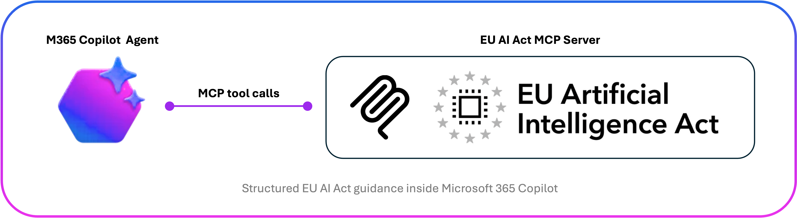
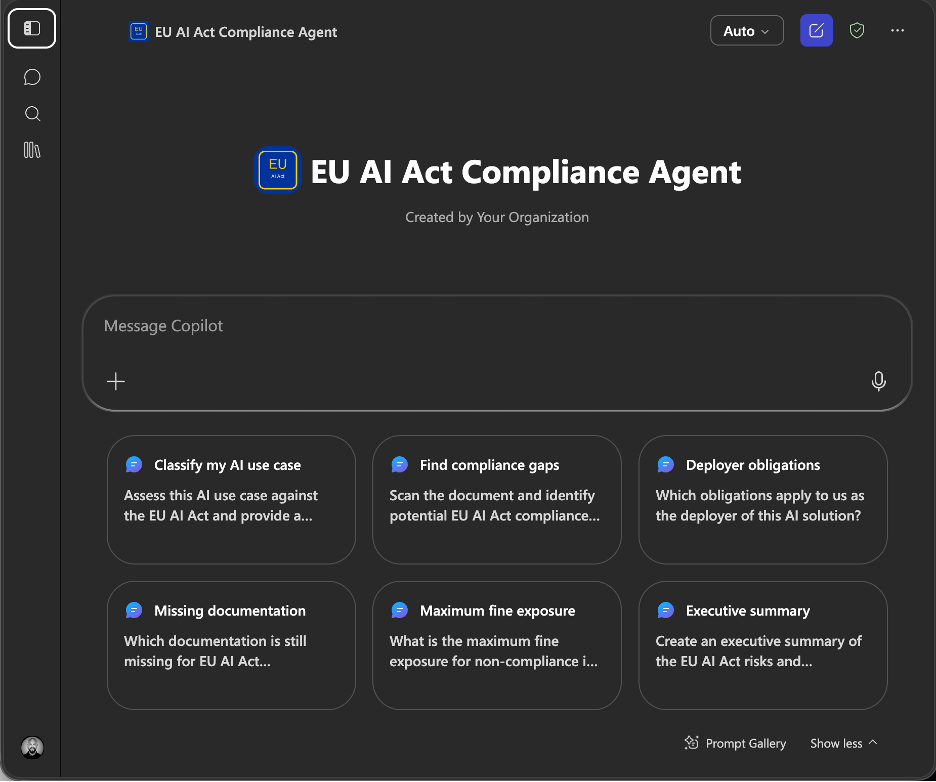
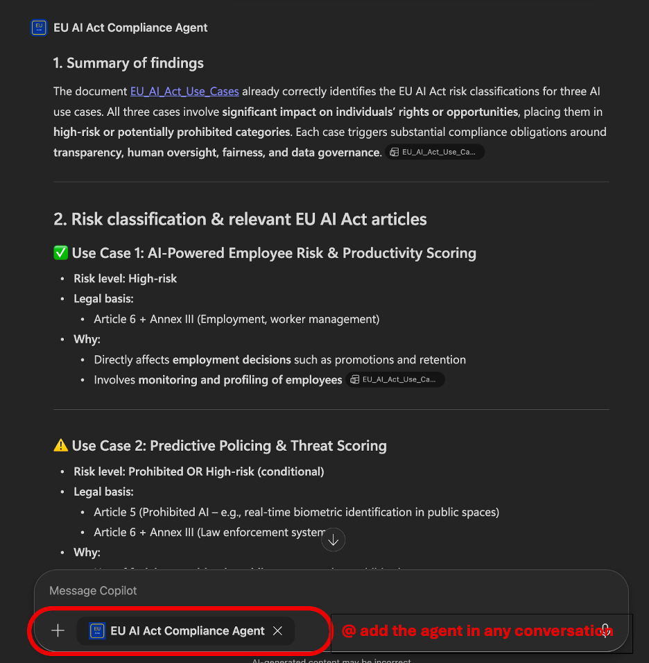
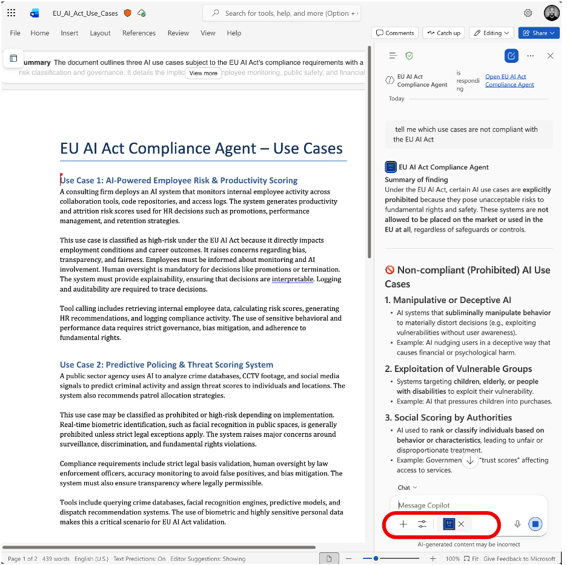
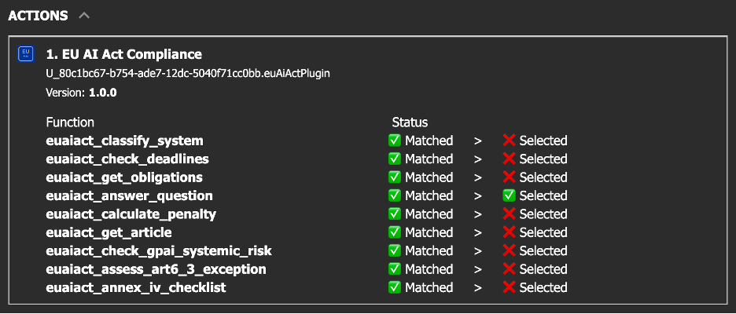

<p align="center">
  
</p>

# EU AI Act Compliance Agent for Microsoft 365 Copilot

Ask EU AI Act questions directly inside Microsoft 365 Copilot, Word, Teams, and standalone agent experiences — backed by dedicated EU AI Act MCP tools instead of generic model knowledge.

This repository packages a **Microsoft 365 declarative agent** that connects Copilot to the [Lexbeam EU AI Act MCP server](https://smithery.ai/servers/lexbeam-software/eu-ai-act). It helps users explore EU AI Act obligations, classifications, deadlines, and documentation expectations — and retrieve article-level references — in a business-readable format.

> **Decision-support tooling, not legal advice.** This agent can help structure EU AI Act analysis, but final compliance decisions remain with accountable humans and qualified legal/compliance professionals.

---

## Why this exists

Organizations adopting AI need practical EU AI Act guidance *where the work already happens* — in the documents, intake forms, reviews, and approvals that flow through Microsoft 365. Generic chat assistants tend to improvise regulatory answers. This agent instead routes each question to purpose-built EU AI Act MCP tools, so responses are structured, consistent, and tied to specific articles.

Typical uses:

- Triage new AI use cases as they are proposed
- Pressure-test vendor "not high-risk" claims
- Prepare for internal AI governance and risk reviews
- Build a shared, plain-language understanding of obligations across teams

---

## What it does

Backed by 9 EU AI Act MCP tools, the agent can:

- **Classify AI systems** by risk level (prohibited, high-risk, limited, minimal)
- **Identify obligations** for providers, deployers, importers, and distributors
- **Check Annex III scope** and the **Article 6(3)** no-significant-risk exception
- **Generate an Annex IV** technical-documentation checklist (Article 11)
- **Retrieve article references** with stable EUR-Lex links
- **Check deadlines** and implementation milestones
- **Estimate maximum fine exposure** under Article 99
- **Assess GPAI / foundation-model systemic risk** under Article 51
- **Answer EU AI Act questions** with article-level references

When a question is ambiguous (for example, *"Is this risky?"*), the agent asks one clarifying question before calling a tool.

---

## Example questions

These map to real enterprise situations — messy intake, vendor claims, internal copilots, document review, and launch readiness.

| Question | What the agent does |
|---|---|
| "We built an internal HR copilot that ranks candidates from CVs. Is it high-risk?" | Risk classification (Annex III employment) |
| "Our vendor says their fraud-scoring model is 'not high-risk'. Can we rely on Article 6(3)?" | Article 6(3) exception assessment |
| "Review this draft system description and flag EU AI Act gaps." | Risk classification + gap analysis |
| "We're the deployer, not the builder. What are our obligations?" | Obligations by role |
| "What technical documentation do we still need before go-live?" | Annex IV checklist |
| "We fine-tuned a large model in-house — are we now a GPAI provider with systemic-risk duties?" | GPAI systemic-risk check |
| "What are the realistic deadlines for the high-risk requirements?" | Deadlines |
| "If this goes wrong, what's our maximum fine exposure?" | Penalty estimate (Article 99) |
| "Can we launch this recruitment tool in the EU next quarter?" | Clarify → classify → obligations |
| "Summarize Article 9 and link the official text." | Article retrieval |

---

## See it in action

**Standalone agent** — a dedicated EU AI Act assistant experience.



**Inside Teams conversations** — bring it into any chat to answer compliance questions in context.



**Inside Office apps like Word** — open the Copilot pane and select the agent via the controls icon (two sliders).



**Developer Mode** — see exactly which MCP tool was called, with inputs and the raw response.



---

## Demo vs enterprise use

This repo ships pointing at the **free, hosted Lexbeam MCP endpoint** so you can try the agent immediately, with no backend to deploy.

| | Hosted Lexbeam endpoint | Self-hosted MCP endpoint |
|---|---|---|
| Best for | Demos, evaluation, learning | Real workloads, sensitive data, regulated environments |
| Setup | None | Deploy from the [open-source server repo](https://github.com/lexbeam-software/eu-ai-act-mcp) |
| Data path | Inputs leave your tenant to a public endpoint | You control hosting and data handling |
| Recommendation | Non-sensitive trials only | Enterprise and internal documents |

> **Hosted endpoint warning.** The hosted Lexbeam endpoint is convenient for demos and learning. For enterprise use, sensitive data, regulated workloads, or internal documents, **self-host the MCP server** and review your own data-handling controls first. See [Swap in your own MCP server](#swap-in-your-own-mcp-server).

---

## How it works

```
User in M365 Copilot Chat · Word · Teams · standalone agent
        │  natural-language question
        ▼
M365 Copilot orchestrator
  • declarativeAgent.json — instructions + tool-routing policy
  • OneDriveAndSharePoint grounding (optional)
        │  selects the plugin via description_for_model
        ▼
ai-plugin.json  (Plugin Manifest v2.4, RemoteMCPServer)
        │  MCP tool call over HTTPS
        ▼
EU AI Act MCP server  (hosted Lexbeam, or self-hosted)
  • 9 euaiact_* tools → structured, article-referenced responses
```

**Request flow**

1. A user asks a question in Copilot Chat, Word, Teams, or the standalone agent.
2. The Copilot orchestrator applies the declarative agent's routing policy.
3. The plugin manifest connects Copilot to the configured MCP server.
4. The matching `euaiact_*` tool returns a structured, article-referenced answer.

**Trust and data boundaries**

- **Prompts and tool inputs are sent to the configured MCP endpoint.** With the hosted endpoint, that data leaves your tenant.
- **Document/SharePoint grounding depends on your M365 configuration** and respects each user's existing permissions — the agent cannot read what the user cannot read.
- **The MCP tools are read-only**: they return regulatory guidance, not your data, and do not modify systems.
- **You choose the backend** — point the agent at the hosted endpoint for demos, or a self-hosted endpoint for controlled data handling.

See [docs/architecture.md](docs/architecture.md) for the full component breakdown and routing policy.

---

## What it is not

- **Not legal advice**, and not a substitute for qualified legal/compliance counsel.
- **Not a replacement for accountable human review** — humans own the final decision.
- **Not a full GRC platform** — there is no workflow engine, evidence store, or audit system here.
- **Not a production privacy model when using the public hosted endpoint** — self-host for sensitive data.
- **Not a guarantee of compliance** — it structures analysis; it does not certify outcomes.
- **Not a write/remediation agent** — it advises; it does not change your systems or documents.

> **No human-in-the-loop (HITL) or human-on-the-loop (HOTL) controls are built into this agent.** It does not pause for approval, escalate to a reviewer, or enforce sign-off. When agents like this are used in EU AI Act assessments or compliance scenarios, HITL and/or HOTL oversight is **strongly advised** and must be designed into your surrounding process. **This agent does not replace human judgement.**

---

## Quick start

### Prerequisites

- VS Code with the [Microsoft 365 Agents Toolkit](https://marketplace.visualstudio.com/items?itemName=TeamsDevApp.ms-teams-vscode-extension) (v6.3+)
- A Microsoft 365 Copilot license
- M365 tenant admin access (for publishing)

### Deploy in 3 steps

```bash
# 1. Clone
git clone https://github.com/doruit/EU-AI-Act-Agent.git
cd EU-AI-Act-Agent
code .

# 2. Sign in to Microsoft 365 in the Agents Toolkit panel

# 3. Agents Toolkit → Lifecycle → Provision → then press F5 to preview
```

Full walkthrough (Word setup, SharePoint scoping, publishing to the org catalog): [docs/deployment.md](docs/deployment.md).

---

## Using the agent in Word, Teams, and standalone

**Microsoft Word (desktop or web)**

1. Open any document and open the **Copilot** pane.
2. Click the **controls icon with two sliders** to open agent selection (**not** the hamburger icon).
3. Select **EU AI Act Compliance Agent**.
4. Ask, for example: *"Scan this document and identify EU AI Act compliance gaps."*

**Microsoft Teams** — add the agent to any conversation and ask compliance questions inline.

**Standalone** — use the dedicated agent experience for focused EU AI Act sessions.

> **Grounding note.** The agent uses `OneDriveAndSharePoint` grounding to search content the signed-in user can already access. For best results on a specific document, store it in OneDrive/SharePoint first.

---

## MCP tools

The agent routes to these 9 tools from the [Lexbeam EU AI Act MCP server](https://smithery.ai/servers/lexbeam-software/eu-ai-act). It prefers a tool over generic model knowledge whenever one applies.

| Tool | Purpose |
|---|---|
| `euaiact_classify_system` | Classify risk level: Prohibited / High-risk / Limited / Minimal |
| `euaiact_get_obligations` | Obligations by role (provider, deployer, importer, distributor) and risk level |
| `euaiact_assess_art6_3_exception` | Article 6(3) no-significant-risk exception for Annex III systems |
| `euaiact_annex_iv_checklist` | Annex IV technical-documentation checklist (Article 11) |
| `euaiact_get_article` | Article summary + EUR-Lex URL (Articles 3–6, 9–17, 26, 27, 43, 47, 49–51, 53, 55, 72, 73, 99, 100, 113) |
| `euaiact_check_deadlines` | Implementation milestones with days remaining |
| `euaiact_calculate_penalty` | Maximum fine under Article 99, with SME/startup reduction |
| `euaiact_check_gpai_systemic_risk` | GPAI / foundation-model systemic risk (Article 51) |
| `euaiact_answer_question` | General EU AI Act Q&A with article references |

**Default endpoint:** `https://eu-ai-act--lexbeam-software.run.tools` · **Auth:** none (free, no API key)

---

## Testing and Developer Mode

[tests/test-cases.md](tests/test-cases.md) contains 32 prompts mapped to expected tools:

- 22 standard single-tool cases
- 6 ambiguous cases (the agent must ask one clarifying question)
- 4 compound, multi-tool cases

**Inspect tool calls with Developer Mode** to confirm routing:

- Turn it on with `-developer on`, and off with `-developer off`.
- With it on, each response shows the selected tool, the inputs sent, and the raw response.


You can also run the agent locally via VS Code Developer Mode (F5 → Preview in Copilot).

---

## Customization

### Swap in your own MCP server

The hosted endpoint is not hard-wired. Self-host with the [open-source server repo](https://github.com/lexbeam-software/eu-ai-act-mcp). As long as your server keeps the same `euaiact_*` tool names and schemas, the agent behaves identically. Update the endpoint in two places:

- `appPackage/ai-plugin.json` → `runtimes[0].spec.url`
- `.vscode/mcp.json` → `servers.eu-ai-act.url`

Then refresh tool metadata (if needed) and re-provision/re-deploy.

### Scope SharePoint grounding

Edit the `OneDriveAndSharePoint` capability in `appPackage/declarativeAgent.json`:

```json
{
  "name": "OneDriveAndSharePoint",
  "items_by_url": [
    { "url": "https://yourorg.sharepoint.com/sites/AIComplianceReviews" }
  ]
}
```

### Update tool-routing rules

Edit the `instructions` field in `appPackage/declarativeAgent.json` (max 8,000 characters). See [docs/architecture.md](docs/architecture.md) for the routing-policy design.

### Replace the icons

Swap `appPackage/color.png` (192×192) and `appPackage/outline.png` (32×32) for your own branded icons. To regenerate the placeholders:

```bash
python3 -m venv .venv && source .venv/bin/activate
pip install Pillow
python scripts/generate-icons.py
```

---

## Repository structure

```
EU-AI-Act-Agent/
├── appPackage/
│   ├── manifest.json           ← M365 App Manifest (v1.18)
│   ├── declarativeAgent.json   ← Agent manifest + instructions + routing policy
│   ├── ai-plugin.json          ← Plugin manifest (v2.4) — MCP server connection
│   ├── mcp-tools.json          ← MCP tool definitions (static snapshot)
│   ├── color.png               ← App icon 192×192
│   └── outline.png             ← App icon 32×32
├── .vscode/
│   ├── mcp.json                ← MCP server config for development
│   ├── launch.json             ← Debug configs (Copilot Chat + Word)
│   └── settings.json           ← JSON schema associations
├── env/
│   ├── .env.dev                ← Environment variables (safe to commit)
│   └── .env.dev.user           ← User-specific vars (gitignored)
├── scripts/
│   └── generate-icons.py       ← Generates placeholder app icons
├── tests/
│   └── test-cases.md           ← 32 test prompts mapped to expected tools
├── docs/
│   ├── architecture.md         ← System architecture and components
│   └── deployment.md           ← Step-by-step deployment guide
├── media/                      ← Screenshots used in this README
├── teamsapp.yml                ← M365 Agents Toolkit lifecycle config
└── README.md
```

---

## Attribution and credits

The EU AI Act MCP server concept, tool taxonomy, and underlying regulatory tooling are the work of **Lexbeam Software**.

- Hosted server (Smithery): https://smithery.ai/servers/lexbeam-software/eu-ai-act
- Open-source server: https://github.com/lexbeam-software/eu-ai-act-mcp
- Publisher: https://www.lexbeam.com

The hosted Lexbeam endpoint covers EU AI Act Regulation (EU) 2024/1689, including the Digital Omnibus simplification proposal. Published Smithery metrics (quality 97/100, ~107 ms latency, 97.6% uptime) are reported by Smithery, not measured by this repository.

If you fork or reuse this project, please keep this attribution and credit Lexbeam Software for the MCP server.

---

## License

Released under the **MIT License**.

---

## Contributing

Issues and pull requests are welcome. If you hit a routing failure or spot a missing scenario, open an issue or submit a PR updating [tests/test-cases.md](tests/test-cases.md) and the relevant routing rules in `appPackage/declarativeAgent.json`.
